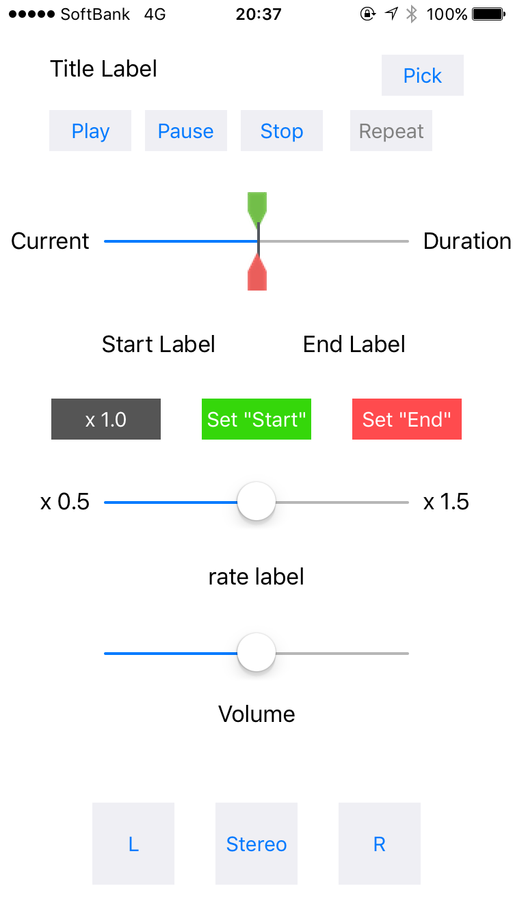

# MusicLooper (Under construction)

## Overview
Music Player for iOS. You can change the speed and repeat a specific part of the song.

## Screenshot

## Description

1) Push [Pick] button to choose a song to play. After that, 

2) You can [Play], [Pause] or [Stop] the song by pushing these buttons.

3) Push [Set "Start"] and [Set "End"] buttons when you want to set "Start" point and "End" point, if you want to repeat a specific part of the song. You can set these points by moving the green pin (to set "start" point) and the red pin (to set "end" point).

4) Push [Repeat] button to repeat the selected part of the song. When the text color of the [Repeat] button is red, repeat mode is enabled.

5) You can change the speed and the valume of the song by changing the value of the sliders.

6) You can also position a sound in the stereo field by pushing [L], [Stereo] or [R] button.

